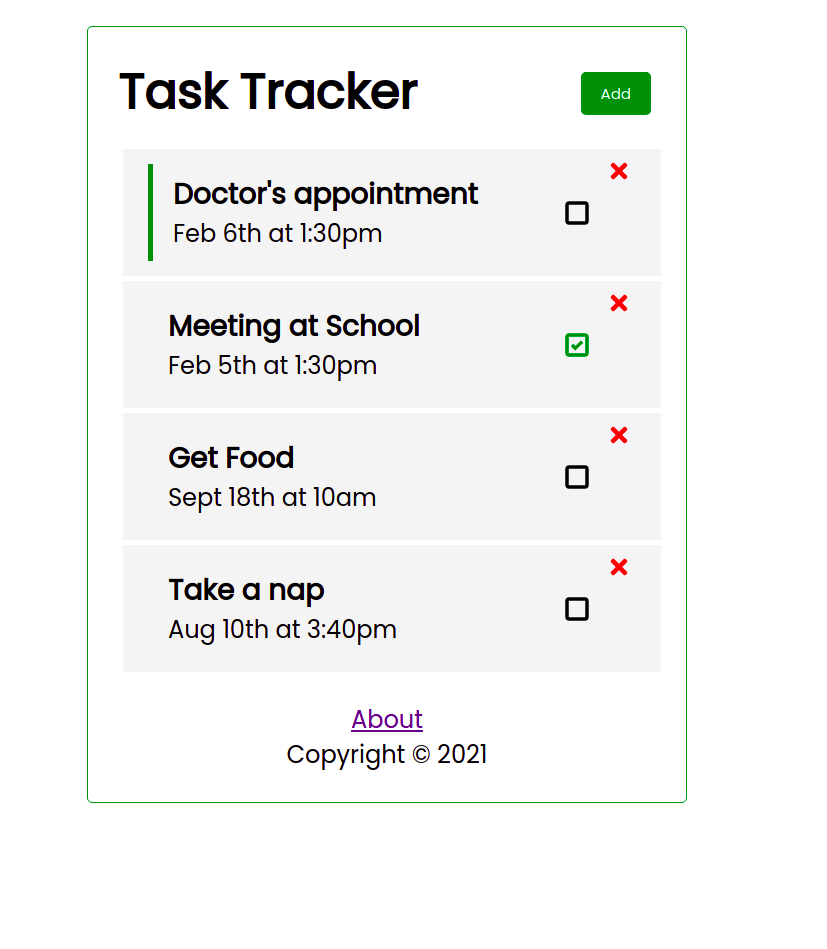
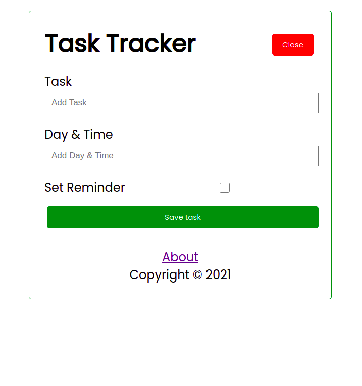
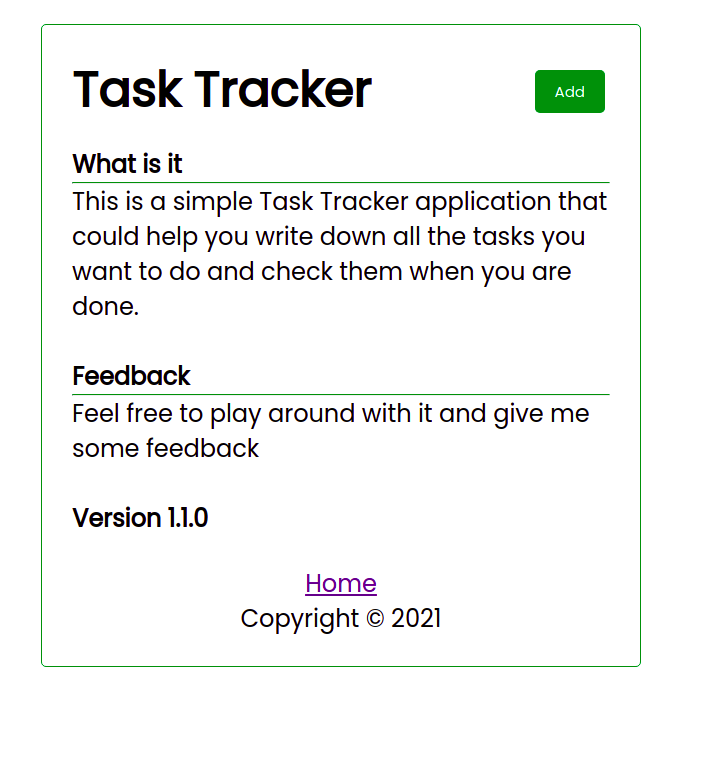

# Getting Started with Create React App

This project was bootstrapped with [Create React App](https://github.com/facebook/create-react-app).

## Available Scripts

In the project directory, you can run:

### `npm start`

Runs the app in the development mode.\
Open [http://localhost:3000](http://localhost:3000) to view it in the browser.

### `npm test`

Launches the test runner in the interactive watch mode.\
### `npm run build`

Builds the app for production to the `build` folder.\
It correctly bundles React in production mode and optimizes the build for the best performance.

## Using the JSON server 
There is a JSON server for REST  API 

### `npm run server`
starts the json server
The server is running on [http://localhost:3001](http://localhost:3001)

### Sample images 
The following are a sample screenshots of the pages
#### Home page

#### Add Task

#### About

